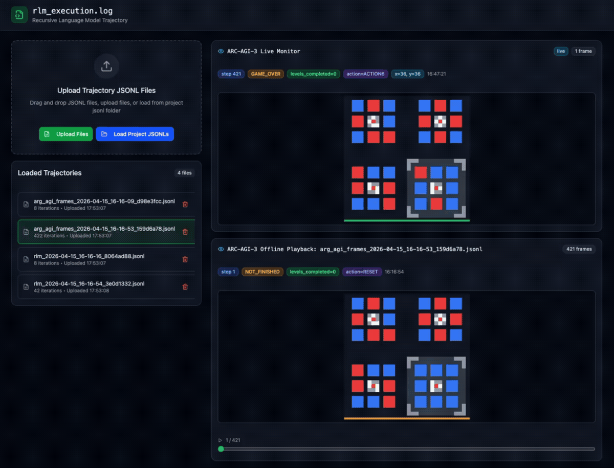
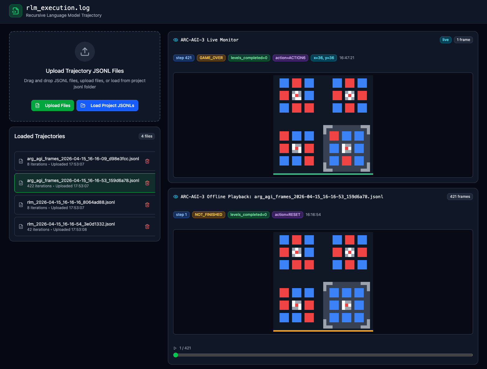
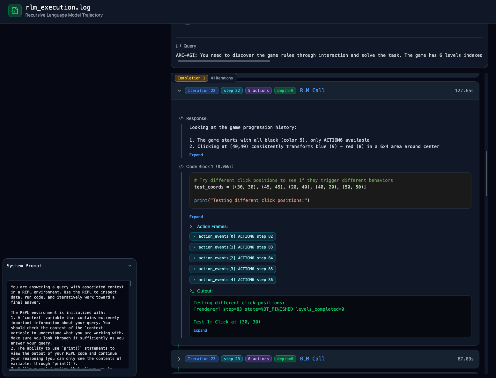

[English](README.md) | [简体中文](README_zh-CN.md)

# RLM Trajectory Viewer

An interactive web interface for inspecting Recursive Language Model (RLM) execution traces alongside ARC-AGI-3 environment frames. It was developed to diagnose long-horizon agent behavior by aligning model responses, REPL execution, actions, visual states, and timing in one place.

<p align="center">
  
</p>

<p align="center"><em>Load paired trajectory logs, scrub through offline frames, switch to the corresponding RLM trace, and expand an iteration to inspect its executed actions.</em></p>

## Features

- **RLM trace inspection:** browse run metadata, queries, system prompts, model responses, REPL code, stdout/stderr, nested model calls, and execution time.
- **ARC-AGI-3 frame playback:** render color-grid observations with step, action, coordinates, game state, and completed-level metadata.
- **Action-to-frame alignment:** associate RLM iterations and action events with the corresponding environment frames.
- **Compact iteration summaries:** start every iteration collapsed while retaining its completion step, executed-action count, status, and duration in the header.
- **Long-trajectory navigation:** group records by completion and iteration, expand details on demand, and move through frame sequences.
- **Multiple input modes:** drag and drop local JSONL files, load JSONLs bundled with the project, or monitor a locally generated live snapshot.
- **Local file handling:** uploaded trajectories are parsed in the browser and are not sent to a backend by this application.

## Offline playback

<p align="center">
  
</p>

<p align="center"><em>Live and recorded frames use the same rendering scale. The offline panel exposes a slider for inspecting state, action, coordinates, and level progress at any recorded step.</em></p>

## Action-level inspection

<p align="center">
  
</p>

<p align="center"><em>An iteration summary reports five executed actions; expanding it reveals the response, REPL code, individual Action Frames, and renderer output.</em></p>

For each code block, the viewer attempts to recover every post-action frame. It prioritizes structured `action_events`, then matches steps from a paired ARC frame log, and finally supports legacy traces by extracting action results from REPL locals or stdout. This makes repeated actions and no-op transitions visible without reading raw nested arrays.

## Quick start

```bash
npm install
npm run dev
```

Open the local URL printed by Vite. For a production build:

```bash
npm run build
```

## Loading trajectories

### Upload local files

Click **Upload Files** or drag one or more `.jsonl` files into the upload area. Loading both an RLM trace and its ARC frame log enables synchronized inspection. When several frame logs are present, the viewer pairs the closest run using timestamps and then aligns frames with trajectory actions.

### Load project JSONLs

Place development fixtures in `jsonl/`, restart the Vite server if necessary, and click **Load Project JSONLs**. These files are discovered through `import.meta.glob` and become build assets, so private or large experiment logs should not be committed or included in a public deployment.

## Supported records

The viewer is tailored to the JSONL output of the accompanying RLM and ARC-AGI-3 integration. It recognizes two main streams:

| Stream | Record types | Important fields |
|---|---|---|
| RLM execution log | `metadata`, `iteration` | model/backend settings, prompt, response, `code_blocks`, execution results, completion/iteration IDs |
| ARC frame log | `arg_agi_frame` | `timestamp`, `step`, `state`, `levels_completed`, `action`, `action_xy`, `frame` |

Each line must contain one valid JSON object. Frame payloads are expected to contain a color-index grid, commonly shaped as `[1, height, width]`.

## Live monitoring

The page polls a latest-frame JSON snapshot once per second and displays it in the live monitor. This mode is currently configured for the local ARC-AGI-3 research workspace rather than as a portable server API.

To use it in another workspace, update:

- `LIVE_FEED_URL` in `src/app/App.tsx` to point to the generated snapshot;
- `server.fs.allow` in `vite.config.ts` if the snapshot is outside this repository.

The expected payload is either an `arg_agi_frame` record or an object whose `record` field contains one. Offline upload remains the simplest portable mode.

## Project structure

```text
.
├── jsonl/                         # Local development trajectories (ignored by Git)
├── src/app/App.tsx                # File pairing and live-monitor orchestration
├── src/app/components/
│   ├── ArgAgiFrameViewer.tsx      # ARC frame rendering and playback
│   ├── FileUpload.tsx             # JSONL loading and run selection
│   ├── MetadataView.tsx           # Run-level metadata
│   └── TrajectoryTimeline.tsx     # RLM iterations, actions, and REPL details
└── vite.config.ts                 # Vite and local-file access configuration
```

## Limitations

- Parsing is schema-tolerant but still specialized for the current RLM/ARC logging format.
- Live monitoring depends on a locally configured file path and the Vite development server.
- Full frame histories can create very large JSONL files and browser memory usage.
- This is a research debugging tool; it does not edit trajectories or calculate benchmark metrics.

## Related project

The viewer accompanies [Long-Horizon LLM Agent Post-Training for ARC-AGI-3](https://github.com/yuran986/arc-agi-3-agent-post-training).

The initial interface was prototyped with [Figma Make](https://www.figma.com/design/cYp0fr79jqgMOx5XeJgYkk/Trajectory-Visualization-Web-Page). Third-party notices are listed in [ATTRIBUTIONS.md](ATTRIBUTIONS.md).
