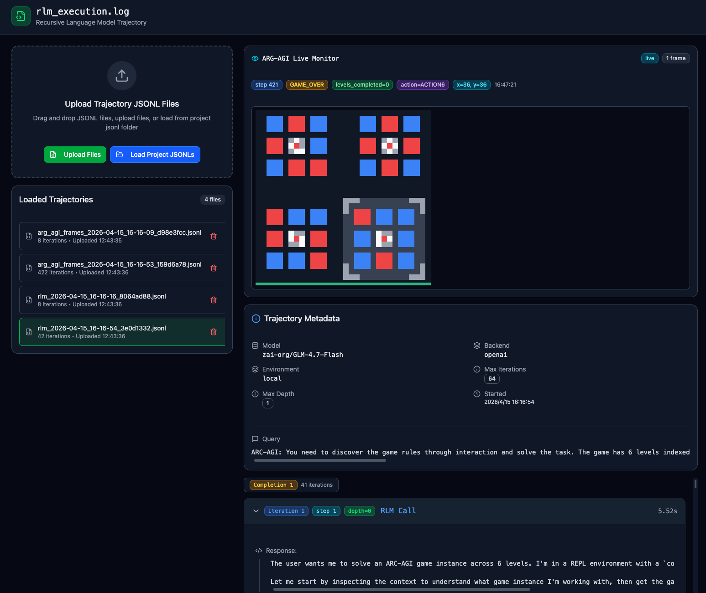
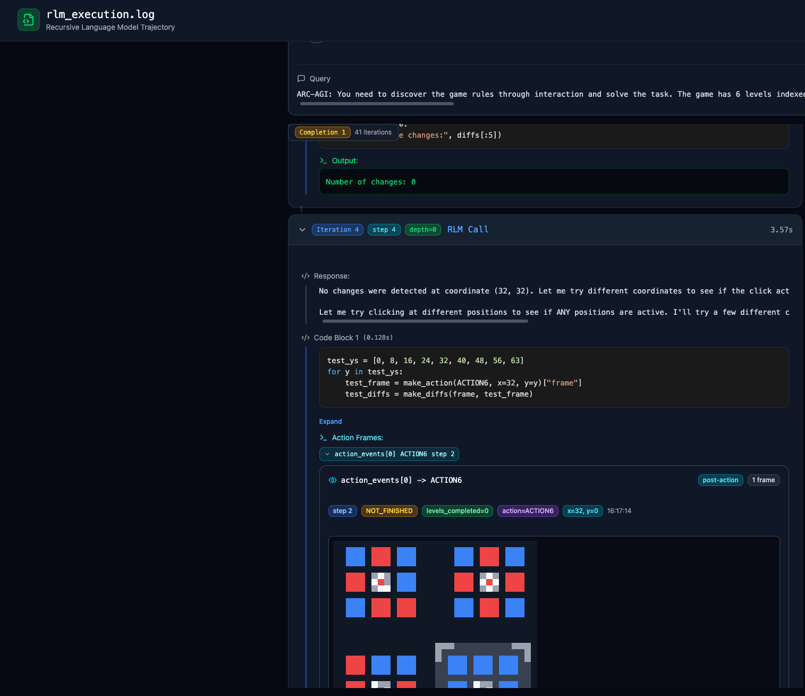

[English](README.md) | [简体中文](README_zh-CN.md)

# RLM 轨迹可视化工具

一个用于联合检查 Recursive Language Model（RLM）执行轨迹和 ARC-AGI-3 环境画面的交互式网页。它将模型回复、REPL 执行、动作、视觉状态和耗时对齐在同一界面中，用于诊断长程 Agent 行为。

<p align="center">
  
</p>

<p align="center"><em>工作区总览：上传并选择运行记录、监控最新环境画面、检查元数据，以及浏览按 completion 分组的 RLM iteration。</em></p>

## 功能

- **RLM 轨迹检查：** 查看运行元数据、任务输入、系统提示词、模型回复、REPL 代码、stdout/stderr、嵌套模型调用和执行耗时。
- **ARC-AGI-3 画面回放：** 渲染颜色网格观测，同时展示 step、动作、坐标、游戏状态和已完成关卡数。
- **动作与画面对齐：** 将 RLM iteration 和动作事件关联到对应的环境画面。
- **长轨迹导航：** 按 completion 和 iteration 组织记录，折叠冗长内容并逐帧浏览。
- **多种输入方式：** 拖放本地 JSONL、读取项目内置 JSONL，或监控本地实时快照。
- **本地文件处理：** 上传的轨迹直接在浏览器中解析，本应用不会将其发送到后端。

## 动作级检查

<p align="center">
  
</p>

<p align="center"><em>展开一轮 iteration，从模型回复、REPL 代码一直追踪到 ACTION6 执行后的画面，同时展示 step、坐标、状态和关卡进度。</em></p>

对于每个 code block，Viewer 会尽可能恢复全部动作后画面：优先读取结构化 `action_events`，其次根据 step 匹配配套的 ARC frame 日志，最后兼容旧轨迹，从 REPL locals 或 stdout 中提取动作结果。这样无需阅读原始嵌套数组，也能直观看到重复动作和没有改变环境的 transition。

## 快速开始

```bash
npm install
npm run dev
```

打开 Vite 输出的本地地址。构建生产版本：

```bash
npm run build
```

## 加载轨迹

### 上传本地文件

点击 **Upload Files**，或将一个或多个 `.jsonl` 文件拖入上传区域。同时加载一份 RLM 日志和对应的 ARC frame 日志后，即可进行同步检查。当存在多份 frame 日志时，Viewer 会根据时间戳匹配最近的一次运行，再将画面与轨迹动作对齐。

### 加载项目 JSONL

将开发用样例放入 `jsonl/`，必要时重启 Vite，然后点击 **Load Project JSONLs**。这些文件通过 `import.meta.glob` 被发现，并会成为构建产物的一部分，因此不应提交私有或体积较大的实验日志，也不应将其打包进公开部署。

## 支持的数据记录

Viewer 针对配套 RLM 与 ARC-AGI-3 集成产生的 JSONL 输出设计，主要识别两类数据流：

| 数据流 | Record 类型 | 重要字段 |
|---|---|---|
| RLM 执行日志 | `metadata`、`iteration` | 模型/后端设置、prompt、response、`code_blocks`、执行结果、completion/iteration ID |
| ARC frame 日志 | `arg_agi_frame` | `timestamp`、`step`、`state`、`levels_completed`、`action`、`action_xy`、`frame` |

每行必须是一个有效的 JSON 对象。Frame payload 应包含颜色索引网格，常见形状为 `[1, height, width]`。

## 实时监控

页面每秒轮询一次最新的 frame JSON 快照，并在 live monitor 中显示。目前该模式服务于本地 ARC-AGI-3 研究环境，尚未封装为可移植的服务端 API。

如果要在其他工作区使用，需要修改：

- `src/app/App.tsx` 中的 `LIVE_FEED_URL`，使其指向生成的快照；
- 如果快照位于本仓库之外，修改 `vite.config.ts` 中的 `server.fs.allow`。

快照内容可以直接是一条 `arg_agi_frame` record，也可以是一个在 `record` 字段中包含该记录的对象。离线上传仍然是最简单、最可移植的使用方式。

## 项目结构

```text
.
├── jsonl/                         # 本地开发轨迹（Git 忽略）
├── src/app/App.tsx                # 文件配对与实时监控编排
├── src/app/components/
│   ├── ArgAgiFrameViewer.tsx      # ARC 画面渲染与回放
│   ├── FileUpload.tsx             # JSONL 加载与运行选择
│   ├── MetadataView.tsx           # 运行级元数据
│   └── TrajectoryTimeline.tsx     # RLM iteration、动作与 REPL 细节
└── vite.config.ts                 # Vite 与本地文件访问配置
```

## 局限性

- 解析逻辑具有一定兼容性，但仍主要面向当前 RLM/ARC 日志格式。
- 实时监控依赖本地配置的文件路径和 Vite 开发服务器。
- 完整 frame 历史可能产生很大的 JSONL 文件并占用较多浏览器内存。
- 这是研究调试工具，不支持编辑轨迹或计算 benchmark 指标。

## 相关项目

本 Viewer 配套用于 [Long-Horizon LLM Agent Post-Training for ARC-AGI-3](https://github.com/yuran986/arc-agi-3-agent-post-training)。

初始界面使用 [Figma Make](https://www.figma.com/design/cYp0fr79jqgMOx5XeJgYkk/Trajectory-Visualization-Web-Page) 制作原型。第三方声明见 [ATTRIBUTIONS.md](ATTRIBUTIONS.md)。
